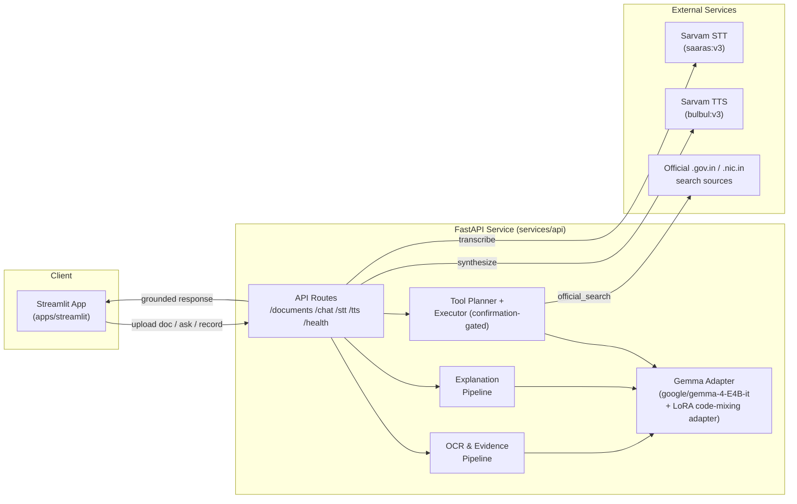
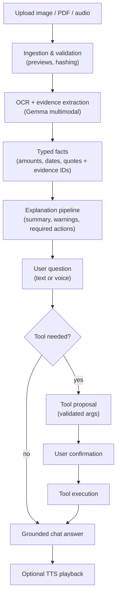

# Project Overview

India's multilingual AI citizen agent, powered by **Gemma 4 E4B**.

This project turns difficult public-service documents into evidence-grounded explanations and safe, user-approved action plans. The demo covers electricity bills, government notices, insurance letters, prescriptions, and property tax bills in **English, Hindi, and Bengali** — including naturally **code-mixed** speech and text across all three languages.

## Features

1. **Multilingual, language-first UI** — user picks English / हिन्दी / বাংলা up front; every label, prompt, and system message is localized (`apps/streamlit/ui_config.py`).
2. **Document upload & ingestion** — drag in a PNG/JPG/PDF and the app validates the file, hashes it for caching, and renders previews (image thumbnails, per-page PDF images, embedded-text extraction, scanned-page detection) before anything is sent to the model (`apps/streamlit/ingestion/`).
3. **Evidence-grounded OCR** — Gemma 4 E4B multimodal inference transcribes each page and extracts amounts, dates, and quotes as structured, source-linked evidence. Anything not explicitly visible on the page is capped at low confidence rather than guessed (`services/api/src/app/ocr/pipeline.py`).
4. **Grounded document explanation** — a second Gemma pass turns the evidence catalog into a plain-language summary, key facts, warnings, and required actions, with every claim traceable back to an `evidence_id` — no unsupported legal/medical/financial claims (`services/api/src/app/explanation/pipeline.py`).
5. **Follow-up chat over the document** — ask questions about the uploaded document in your own language and preferred explanation style (simple, step-by-step, elderly, farmer, student); answers stay grounded in the extracted evidence (`services/api/src/app/api/routes/chat.py`).
6. **Voice in, voice out** — record a spoken question, get it transcribed (Sarvam `saaras:v3` STT), send it into the same chat pipeline, and play the reply back as speech (Sarvam `bulbul:v3` TTS) (`services/api/src/app/stt/`, `services/api/src/app/tts/`).
7. **Confirmation-gated tool use** — Gemma may propose a tool call, but the app validates the tool name, arguments, and permissions, and requires explicit user confirmation before anything with a side effect executes (`services/api/src/app/tools/`).
8. **Session memory** — active document, extracted facts, and chat history persist for the session and reset cleanly on demand (`apps/streamlit/session_memory.py`).
9. **LoRA fine-tuned for code-mixing** — `google/gemma-4-E4B-it` is LoRA fine-tuned on the **SentMix-3L** tri-lingual (Bangla + English + Hindi) code-mixed dataset so the model handles natural code-switching instead of only "clean" single-language text (`finetuning/gemma4_e4b_codemixing_finetune.ipynb`).

## Tools available to the agent

Gemma selects at most one tool per turn from a strict allow-list; the tool planner validates the call, and the executor requires user confirmation for anything side-effecting before it runs.

| Tool | Purpose | Confirmation required? |
| --- | --- | --- |
| `add_amounts` | Sum a list of monetary/decimal amounts (e.g. bill line items) | No — read-only calculation |
| `official_search` | Search official government sources, restricted to `.gov.in` / `.nic.in` domains | No — read-only lookup |
| *(planned)* reminder / office lookup | Create reminders or find the right government office | Yes — creates an external side effect |

New tools are registered in `services/api/src/app/tools/registry.py`; any tool marked as creating an external side effect is rejected at registration time unless it also requires confirmation.

## Architecture

### System components



### Request flow



The model may propose a tool call, but application code validates its name, arguments, permissions, and confirmation state before execution.

## Model

- **Base model:** `google/gemma-4-E4B-it` (multimodal — text, image, audio) via `transformers`, loaded in `services/api/src/app/inference/gemma.py`.
- **LoRA fine-tuning for code-mixing:** `finetuning/gemma4_e4b_codemixing_finetune.ipynb` fine-tunes the same base model with a LoRA adapter (`r=16`, `alpha=32`, all-linear target modules, 4-bit base weights) on **SentMix-3L**, the only surveyed dataset that is genuinely tri-lingual Bangla+English+Hindi code-mixed text — matching this project's three target languages. This teaches the model to handle real-world code-switched input (e.g. "eta amar bill ache, please explain koro") rather than only clean, single-language sentences.
- **Speech:** Sarvam `saaras:v3` for speech-to-text and `bulbul:v3` for text-to-speech, both scoped to `en-IN` / `hi-IN` / `bn-IN`.

## Repository layout

```text
apps/streamlit/            Primary demo UI (language-first, upload, chat, voice)
apps/web/                  Mobile-first Next.js interface
services/api/              FastAPI agent, document pipeline, tools, Gemma adapter
packages/contracts/        Shared JSON contracts
finetuning/                LoRA fine-tuning notebook for code-mixing
samples/demo/               Sample documents in en/hi/bn for local testing
```

## Local setup

Copy `.env.example` to `.env`, then start each workspace independently.

### API

```powershell
cd services/api
python -m venv .venv
.venv\Scripts\Activate.ps1
pip install -e ".[dev]"
uvicorn app.main:app --reload
```

The API health endpoint is `http://localhost:8000/api/v1/health`.

### Streamlit app

```powershell
cd apps/streamlit
python -m venv .venv
.venv\Scripts\Activate.ps1
pip install -r requirements.txt
streamlit run app.py
```

Open `http://localhost:8501`. Set `API_BASE_URL` if the API isn't running on `http://127.0.0.1:8000`.

### Web

```powershell
cd apps/web
npm install
npm run dev
```

Open `http://localhost:3000`.

## Status

Gemma inference, PDF/image ingestion, OCR, grounded explanation, confirmation-gated tool use, voice I/O, and a LoRA code-mixing fine-tune are all wired up in the Streamlit demo. External tool providers beyond the calculator and official search (e.g. reminders, office lookup) are the next milestone.
